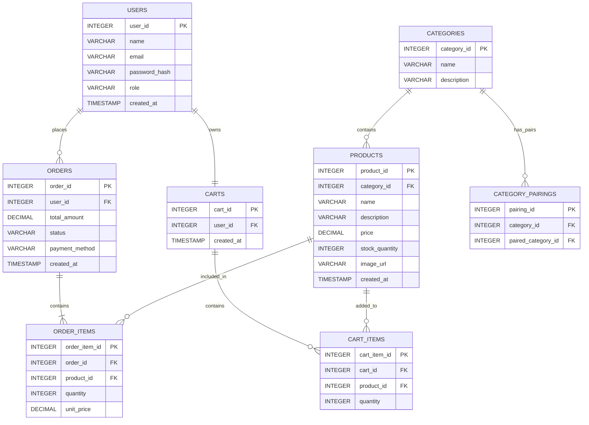

# Sprint 1 – System Architecture & Scope Definition

**Project Title:** Hnoss Atelier – Online Clothing E-Commerce Platform
**Course:** E-Commerce
**Sprint:** 1 – Architecture & Scope Definition

---

## 1. Target Audience & Market Focus

### Primary Persona

Hnoss Atelier is built for students, young professionals, and everyday shoppers who would rather browse and buy clothing from their phone or laptop than visit a physical store. These users expect a fast, straightforward path from discovering a product to completing an order.

### Core Pain Point

Shoppers looking for clothing online are often forced to dig through cluttered listings, inconsistent categorization, and confusing checkout flows spread across multiple stores. Hnoss Atelier addresses this by giving customers one organized storefront where they can search, compare, and purchase apparel in a few clicks, while giving staff a single dashboard to manage products, stock levels, and incoming orders.

### Domain Scope

**Vertical Market:** Fashion & Apparel Retail

Launch catalog will cover:

- Shirts
- T-Shirts
- Jeans & Trousers
- Jackets
- Shoes
- Fashion Accessories

---

## 2. Minimum Viable Product (MVP) Feature Scope

| Category | Feature Name | Description | Priority |
|---|---|---|---|
| Authentication | Account Registration & Login | Customers register and sign in with an email/password pair; credentials are hashed before storage and sessions are managed with JWTs. | High (MVP) |
| Catalog | Browse & Search Products | Customers can browse the catalog and narrow results by category, keyword, or price range. | High (MVP) |
| Cart | Cart Management | Customers can add products to a persistent cart, adjust quantities, and remove line items before checkout. | High (MVP) |
| Checkout | Order Placement | Customers review their cart and submit an order using a mock payment flow or Cash on Delivery. | High (MVP) |
| Orders | Order History | Signed-in customers can review the status and contents of past and active orders. | Medium |
| Admin | Inventory Control | Staff can create, edit, and remove products, and keep stock counts accurate. | Medium |
| Recommendations | Outfit Pairing Suggestions | On a product page, the system suggests items from complementary categories (e.g. a shirt suggests jeans and accessories) to encourage larger orders. | Low (Novelty) |

This scope is deliberately narrow enough to be buildable within a single academic semester while still covering the full purchase journey from browsing to order confirmation. The pairing feature is scoped as a lightweight addition on top of the core flow rather than a separate subsystem, so it does not put the MVP deadline at risk.

---

## 3. Tech Stack Selection & Justification

### Frontend Framework: React.js

React's component model lets the team break the storefront into reusable pieces (product cards, cart widgets, forms) instead of hand-managing DOM updates the way plain HTML/CSS/JS would require. Its large ecosystem and documentation base also make it easier for a student team to find solutions quickly when they get stuck.

### Backend Infrastructure: Node.js + Express.js

Running JavaScript on both ends of the stack means the team isn't context-switching between languages, which speeds up development for a small group. Express keeps the API layer lightweight — routing, middleware, and auth logic can be added incrementally without a heavy framework getting in the way.

### Database Management System: PostgreSQL

The data in this system — users, products, categories, orders, and order line items — is inherently relational, with clear foreign-key dependencies and a need for transactional integrity (e.g., an order and its items must be created together). A relational engine like PostgreSQL enforces those constraints natively, which a document store would leave to application code.

### Authentication

Sessions are handled with JSON Web Tokens. Plaintext passwords are never persisted; each password is salted and hashed before it touches the database.

### Caching & Asynchronous Processing (Optional)

No caching or background-job layer (e.g., Redis, Celery) is planned for the MVP. Catalog and order volume during the semester project is small enough that direct PostgreSQL queries are expected to perform adequately. This is flagged as a candidate improvement for a later sprint if search latency or order-processing load becomes a bottleneck.

---

## 4. Novelty Feature: Outfit Pairing Suggestions

Most student e-commerce projects stop at "browse, cart, checkout." Hnoss Atelier adds one small differentiator: when a customer views a product, the page also shows two or three items from categories that typically go with it — a shirt page suggests jeans and accessories, a jacket page suggests jeans and shoes, and so on.

**Why this is easy to build:** the logic doesn't require machine learning or purchase history. It runs off a single new lookup table, `Category_Pairings`, that maps each category to the categories considered complementary to it (e.g. Shirts → Jeans, Shirts → Accessories). When a product page loads, the backend looks up the product's category, finds its paired categories in that table, and pulls a few in-stock products from each. Populating this table is a one-time manual step by the admin — no model training, no external service.

**Why this is easy to defend:** the entire feature is one extra table plus one extra query. In a viva, it can be explained end-to-end as "look up my category → look up its pairs → fetch products from those categories," with no hidden complexity.

This keeps the novelty genuinely additive rather than a second project competing with the core MVP for time.

---

## 5. Entity-Relationship Diagram (ERD)

### Core Entities

- Users
- Categories
- Products
- Orders
- Order_Items (associative entity linking Orders and Products)
- Carts
- Cart_Items (associative entity linking Carts and Products)
- Category_Pairings (self-referencing associative entity linking a Category to its complementary Categories, supporting the outfit pairing feature)

### Relationship Summary

- A User can place many Orders (1:N).
- A User owns exactly one Cart (1:1).
- A Category groups many Products (1:N).
- An Order is made up of many Order_Items (1:N).
- A Product can appear in many Order_Items (1:N) — the Orders↔Products many-to-many relationship is resolved through Order_Items.
- A Cart holds many Cart_Items (1:N).
- A Product can appear in many Cart_Items (1:N) — the Carts↔Products many-to-many relationship is resolved through Cart_Items.
- A Category can be paired with many other Categories, and can itself be listed as a pair for many other Categories (N:M) — resolved through Category_Pairings.

### Diagram

### Entity Attribute Reference

**Users**

| Attribute | Data Type | Key |
|---|---|---|
| user_id | INTEGER | PK |
| name | VARCHAR(100) | |
| email | VARCHAR(150) | Unique |
| password_hash | VARCHAR(255) | |
| role | VARCHAR(20) | |
| created_at | TIMESTAMP | |

**Categories**

| Attribute | Data Type | Key |
|---|---|---|
| category_id | INTEGER | PK |
| name | VARCHAR(100) | |
| description | VARCHAR(255) | |

**Category_Pairings**

| Attribute | Data Type | Key |
|---|---|---|
| pairing_id | INTEGER | PK |
| category_id | INTEGER | FK |
| paired_category_id | INTEGER | FK |

**Products**

| Attribute | Data Type | Key |
|---|---|---|
| product_id | INTEGER | PK |
| category_id | INTEGER | FK |
| name | VARCHAR(150) | |
| description | VARCHAR(500) | |
| price | DECIMAL(10,2) | |
| stock_quantity | INTEGER | |
| image_url | VARCHAR(255) | |
| created_at | TIMESTAMP | |

**Orders**

| Attribute | Data Type | Key |
|---|---|---|
| order_id | INTEGER | PK |
| user_id | INTEGER | FK |
| total_amount | DECIMAL(10,2) | |
| status | VARCHAR(50) | |
| payment_method | VARCHAR(50) | |
| created_at | TIMESTAMP | |

**Order_Items**

| Attribute | Data Type | Key |
|---|---|---|
| order_item_id | INTEGER | PK |
| order_id | INTEGER | FK |
| product_id | INTEGER | FK |
| quantity | INTEGER | |
| unit_price | DECIMAL(10,2) | |

**Carts**

| Attribute | Data Type | Key |
|---|---|---|
| cart_id | INTEGER | PK |
| user_id | INTEGER | FK |
| created_at | TIMESTAMP | |

**Cart_Items**

| Attribute | Data Type | Key |
|---|---|---|
| cart_item_id | INTEGER | PK |
| cart_id | INTEGER | FK |
| product_id | INTEGER | FK |
| quantity | INTEGER | |

### Cardinality Summary

| Relationship | Cardinality |
|---|---|
| Users → Orders | 1:N |
| Users → Carts | 1:1 |
| Categories → Products | 1:N |
| Orders → Order_Items | 1:N |
| Products → Order_Items | 1:N |
| Carts → Cart_Items | 1:N |
| Products → Cart_Items | 1:N |
| Categories → Categories (via Category_Pairings) | N:M |

---

## Sprint 1 Conclusion

This sprint locks down who Hnoss Atelier is being built for, what the MVP will and won't include, which technologies will carry that scope, and how the underlying data is structured. The outfit pairing feature adds a small point of differentiation on top of a standard e-commerce flow without adding meaningful build risk. Together these decisions give the team a stable foundation to start implementation in Sprint 2 without re-litigating basic architecture along the way.
