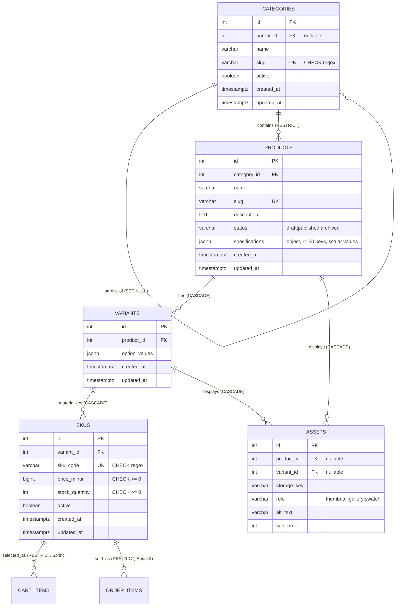

# Sprint 2 — Catalog Data Foundation (Hnoss Atelier)

## 1. Sprint Goal and Scope Boundary

**Goal:** Turn the Sprint 1 architecture and Week 3 catalog model into a reliable database foundation so Sprint 3+ (public catalog, cart, checkout) can consume it without re-modeling.

**In scope:**
- Category tree (parent_id, unique slug, active status)
- Products (status, description, category assignment, JSONB specification stub)
- Variants (product grouping) and SKUs (unique code, integer-minor price, non-negative stock, active flag)
- Authenticated admin CRUD for all above
- DB constraints (UNIQUE, CHECK, FK delete policies, business-rule trigger)
- Reproducible seed data
- Automated tests for model, validation, and authorization

**Out of scope (Sprint 3+):** dynamic specification schemas, asset upload, public catalog search, publication workflows, payment gateway, order placement, shipping, shopper checkout.

## 2. Link to Sprint 1 Decisions

| Sprint 1 Decision | Sprint 2 Treatment |
|---|---|
| Stack: React + Node/Express + PostgreSQL + JWT | Reused unchanged |
| MVP entities: Users, Categories, Products, Carts, Cart_Items, Orders, Order_Items, Category_Pairings | Preserved; Sprint 2 adds Variants, SKUs, Assets |
| `products.price DECIMAL(10,2)` | Price moved to `skus.price_minor BIGINT` (integer minor units); no float money |
| `products.stock_quantity INTEGER` | Stock moved to `skus.stock_quantity` with `CHECK (stock_quantity >= 0)` |
| `products.image_url VARCHAR(255)` | Replaced by `assets` table (product or variant, role, alt_text, sort_order) |
| Flat `categories` table | Extended with `parent_id`, `slug`, `active`, timestamps |
| `orders.total_amount DECIMAL` | `orders.total_minor BIGINT` planned for Sprint 3; DECIMAL retained for one sprint |
| `order_items.unit_price DECIMAL` | `order_items.unit_price_minor BIGINT` planned for Sprint 3 |
| `cart_items.product_id` / `order_items.product_id` | Retained; `sku_id` FK planned for Sprint 3 migration |
| Novelty feature: Category_Pairings | Retained; FK constraints added in Sprint 3 migration |
| Specifications | Not in Sprint 1; new `products.specifications JSONB` with Sprint 2 validation rule |

## 3. Updated ERD



**Cardinality and FK policy summary:**

| Relationship | Cardinality | Delete Policy |
|---|---|---|
| categories.parent_id → categories.id | 1:N (self) | SET NULL |
| products.category_id → categories.id | N:1 | RESTRICT |
| variants.product_id → products.id | N:1 | CASCADE |
| skus.variant_id → variants.id | N:1 | CASCADE |
| assets.product_id → products.id | N:1 | CASCADE |
| assets.variant_id → variants.id | N:1 | CASCADE |

## 4. Data Dictionary

### categories
| Column | Type | Constraints | Default |
|---|---|---|---|
| id | SERIAL | PK | — |
| parent_id | INTEGER | FK → categories.id, nullable | NULL |
| name | VARCHAR(100) | NOT NULL | — |
| slug | VARCHAR(120) | UNIQUE NOT NULL, CHECK regex | — |
| active | BOOLEAN | NOT NULL | TRUE |
| created_at | TIMESTAMPTZ | NOT NULL | now() |
| updated_at | TIMESTAMPTZ | NOT NULL | now() |

### products
| Column | Type | Constraints | Default |
|---|---|---|---|
| id | SERIAL | PK | — |
| category_id | INTEGER | FK → categories.id NOT NULL | — |
| name | VARCHAR(150) | NOT NULL | — |
| slug | VARCHAR(150) | UNIQUE NOT NULL, CHECK regex | — |
| description | TEXT | nullable | NULL |
| status | VARCHAR(20) | CHECK IN (draft,published,archived) | 'draft' |
| specifications | JSONB | NOT NULL | '{}' |
| created_at | TIMESTAMPTZ | NOT NULL | now() |
| updated_at | TIMESTAMPTZ | NOT NULL | now() |

### variants
| Column | Type | Constraints | Default |
|---|---|---|---|
| id | SERIAL | PK | — |
| product_id | INTEGER | FK → products.id NOT NULL | — |
| option_values | JSONB | NOT NULL | '{}' |
| created_at | TIMESTAMPTZ | NOT NULL | now() |
| updated_at | TIMESTAMPTZ | NOT NULL | now() |

### skus
| Column | Type | Constraints | Default |
|---|---|---|---|
| id | SERIAL | PK | — |
| variant_id | INTEGER | FK → variants.id NOT NULL | — |
| sku_code | VARCHAR(64) | UNIQUE NOT NULL, CHECK regex | — |
| price_minor | BIGINT | CHECK ≥ 0 | — |
| stock_quantity | INTEGER | CHECK ≥ 0 | 0 |
| active | BOOLEAN | NOT NULL | TRUE |
| created_at | TIMESTAMPTZ | NOT NULL | now() |
| updated_at | TIMESTAMPTZ | NOT NULL | now() |

### assets
| Column | Type | Constraints | Default |
|---|---|---|---|
| id | SERIAL | PK | — |
| product_id | INTEGER | FK → products.id, nullable | NULL |
| variant_id | INTEGER | FK → variants.id, nullable | NULL |
| storage_key | VARCHAR(255) | NOT NULL | — |
| role | VARCHAR(20) | CHECK IN (thumbnail,gallery,swatch) | 'gallery' |
| alt_text | VARCHAR(255) | nullable | NULL |
| sort_order | INTEGER | NOT NULL | 0 |
| created_at | TIMESTAMPTZ | NOT NULL | now() |

**Constraint:** exactly one of `product_id` / `variant_id` must be set.

## 5. Administration Contract

All routes below require `Authorization: Bearer <admin-jwt>`. Missing or invalid → 401. Non-admin role → 403.

| Method | Route | Purpose |
|---|---|---|
| POST | /api/v1/admin/categories | Create category |
| GET | /api/v1/admin/categories | Return category tree |
| PATCH | /api/v1/admin/categories/:id | Update/deactivate category |
| POST | /api/v1/admin/products | Create draft product |
| GET | /api/v1/admin/products | List admin products (`?category_id=&status=`) |
| GET | /api/v1/admin/products/:id | Read single product |
| PATCH | /api/v1/admin/products/:id | Update product |
| POST | /api/v1/admin/products/:id/variants | Add variant |
| POST | /api/v1/admin/products/variants/:variantId/skus | Add SKU |
| PATCH | /api/v1/admin/skus/:id | Update price / stock / active |

**Consistent error envelope:**
```json
{ "error": "CODE", "message": "human readable", "field": "optional" }
```
Codes: `VALIDATION`, `DUPLICATE_VALUE`, `CONSTRAINT_VIOLATION`, `BUSINESS_RULE`, `NOT_FOUND`, `UNAUTHENTICATED`, `FORBIDDEN`, `INTERNAL`.

### Examples

**POST /api/v1/admin/categories**
```json
Request:  { "name": "Men", "slug": "men" }
201:      { "id": 1, "parent_id": null, "name": "Men", "slug": "men", "active": true }
409:      { "error": "DUPLICATE_VALUE", "message": "Duplicate value for slug", "field": "slug" }
422:      { "error": "VALIDATION", "message": "name and slug required" }
401:      { "error": "UNAUTHENTICATED", "message": "Missing token" }
403:      { "error": "FORBIDDEN", "message": "Admin role required" }
```

**POST /api/v1/admin/products**
```json
Request:  { "name": "Oxford Shirt", "slug": "oxford-shirt", "category_id": 3 }
201:      { "id": 12, "status": "draft", ... }
422:      { "error": "VALIDATION", "message": "name, slug, category_id required" }
409:      { "error": "DUPLICATE_VALUE", "message": "Duplicate value for slug" }
```

**PATCH /api/v1/admin/products/:id (publish without SKU)**
```json
Request:  { "status": "published" }
422:      { "error": "BUSINESS_RULE", "message": "Published product 12 must have at least one active SKU" }
```

**POST /api/v1/admin/products/:id/variants**
```json
Request:  { "option_values": { "Size": "M", "Color": "Blue" } }
201:      { "id": 5, "product_id": 12, "option_values": { ... } }
```

**POST /api/v1/admin/products/variants/:variantId/skus**
```json
Request:  { "sku_code": "OX-M-BLUE", "price_minor": 4500, "stock_quantity": 8 }
201:      { "id": 1, "sku_code": "OX-M-BLUE", "price_minor": 4500, "stock_quantity": 8, "active": true }
409:      { "error": "DUPLICATE_VALUE", "message": "Duplicate value for sku_code" }
422:      { "error": "VALIDATION", "message": "sku_code and price_minor required" }
```

**PATCH /api/v1/admin/skus/:id**
```json
Request:  { "stock_quantity": 0, "active": true }
200:      { "id": 1, "stock_quantity": 0, "active": true, ... }
422:      { "error": "VALIDATION", "message": "stock_quantity cannot be negative" }
```

## 6. Data Integrity and Authorization Decisions

### Integrity
1. **Money** uses `BIGINT price_minor` (integer minor units). No floating-point money.
2. **Stock** has `CHECK (stock_quantity >= 0)` at DB level; API also rejects negatives with 422.
3. **Uniqueness** of `categories.slug`, `products.slug`, `skus.sku_code` enforced by UNIQUE constraints. Postgres 23505 → HTTP 409.
4. **Category cycle prevention** implemented in service layer by walking the parent chain; self-parent rejected at both service and DB level.
5. **Published products must have ≥1 active SKU** enforced by trigger `trg_published_product_has_sku`. Not bypassable from the API.
6. **FK delete policies:** CASCADE for owned children (variants, skus, assets), RESTRICT for referenced history (products ↔ categories), SET NULL for the self-referential category parent.
7. **Asset owner rule:** CHECK constraint forces exactly one of `product_id` / `variant_id`.

### Specifications validation rule (Sprint 2)
`products.specifications` must be a JSON object (not array, not scalar), **≤ 50 keys**, **scalar values only**. Violations return `422 { error: "INVALID_SPECIFICATIONS" }`. Sprint 3 will replace this with a category-level schema.

### Authorization
1. All `/api/v1/admin/*` routes go through `requireAuth` + `requireAdmin`.
2. `requireAuth` returns 401 for missing or invalid JWT.
3. `requireAdmin` returns 403 when `req.user.role !== 'admin'`.

### Business rules and edge cases
1. **Draft product with no SKU?** Yes — allowed. **Published product with no sellable SKU?** No — blocked by the DB trigger (returns 422 `BUSINESS_RULE`).
2. **Product category assignment?** One canonical category per product (`category_id` FK). Many-to-many is deferred to keep Sprint 3 catalog queries predictable.
3. **Deactivated parent category?** Parent row's `active` flag flips, children remain linked via `parent_id`. Public catalog (Sprint 3) hides products under any inactive ancestor using a recursive CTE.
4. **Out-of-stock SKU in a public response?** `"available": false, "stock_quantity": 0`. The SKU is still returned so the storefront can show "Notify me."
5. **Two SKUs sharing a price?** Yes, allowed. Each SKU carries its own `price_minor` — no override table in Sprint 2.
6. **Negative stock / duplicate SKU codes?** Prevented by `CHECK (stock_quantity >= 0)` and `UNIQUE (sku_code)`; both are enforced at DB level, and the API also pre-checks for clearer 422/409 responses.
7. **Deactivated product referenced by a future cart or order?** Preserved. Sprint 3 will add a `sku_id` FK with `ON DELETE RESTRICT` to cart_items / order_items. Historical orders use the snapshot `unit_price_minor` field, so deactivation never rewrites history.

## 7. Seed Data and Demonstration

### Run
```bash
cd backend
npm install
createdb hnoss_atelier
createdb hnoss_atelier_test
npm run migrate
npm run seed
npm start
```

### Seeded content
- **Categories (2 levels):** Men → Shirts, Men → Jeans; plus Women
- **Products (3):** Classic Oxford Shirt (published, 3 variants), Slim Fit Jeans (published), Linen Camp Shirt (draft)
- **Variants (4):** OX S/M/L, JEAN 32
- **SKUs (5):** OX-S-BLUE, OX-M-BLUE, OX-L-BLUE, JEAN-32-IND (active) + OX-XL-BLUE (inactive — demonstrates the *unavailable combination* rule; no fake zero-stock row is created)
- **Assets (3):** thumbnails and gallery entries for products

### Demonstration flow

```bash
TOKEN=$(node -e "console.log(require('jsonwebtoken').sign({role:'admin'},process.env.JWT_SECRET))")
H="Authorization: Bearer $TOKEN"
J="Content-Type: application/json"

# 1) Create category
curl -s -X POST localhost:4000/api/v1/admin/categories -H "$H" -H "$J" \
  -d '{"name":"Accessories","slug":"accessories"}'
# → 201 {"id":5,"slug":"accessories",...}

# 2) Create product
curl -s -X POST localhost:4000/api/v1/admin/products -H "$H" -H "$J" \
  -d '{"name":"Leather Belt","slug":"leather-belt","category_id":5,"status":"draft"}'
# → 201 {"id":4,...}

# 3) Add variant
curl -s -X POST localhost:4000/api/v1/admin/products/4/variants -H "$H" -H "$J" \
  -d '{"option_values":{"Size":"One Size","Color":"Brown"}}'
# → 201 {"id":5,...}

# 4) Add SKU
curl -s -X POST localhost:4000/api/v1/admin/products/variants/5/skus -H "$H" -H "$J" \
  -d '{"sku_code":"BELT-OS-BRN","price_minor":2900,"stock_quantity":15}'
# → 201 {"id":6,"sku_code":"BELT-OS-BRN",...}

# 5) Publish (succeeds because SKU exists)
curl -s -X PATCH localhost:4000/api/v1/admin/products/4 -H "$H" -H "$J" \
  -d '{"status":"published"}'
# → 200 {"id":4,"status":"published",...}

# 6) Retrieve
curl -s localhost:4000/api/v1/admin/products/4 -H "$H"
# → 200 full row
```

Tokens are generated locally and never committed.

## 8. Test Strategy, Command, Result

**Command:** `cd backend && npm test`

**Coverage:**

| Test | File | Expectation |
|---|---|---|
| unauthenticated admin write | auth.test.js | 401 |
| non-admin role | auth.test.js | 403 |
| invalid token | auth.test.js | 401 |
| create category | categories.test.js | 201 |
| duplicate category slug | categories.test.js | 409 |
| missing category fields | categories.test.js | 422 |
| category cycle A→B→A | categories.test.js | 422 CYCLE |
| category tree GET | categories.test.js | 200 nested |
| create product | products.test.js | 201 |
| duplicate product slug | products.test.js | 409 |
| missing product fields | products.test.js | 422 |
| invalid specifications | products.test.js | 422 INVALID_SPECIFICATIONS |
| publish without SKU | products.test.js | 422 BUSINESS_RULE |
| duplicate SKU code | skus.test.js | 409 |
| negative price | skus.test.js | 422 |
| negative stock update | skus.test.js | 422 |
| DB rejects negative stock | skus.test.js | rejected promise |
| valid SKU update | skus.test.js | 200 |

**Recorded output:**
```
PASS tests/auth.test.js
  ✓ unauthenticated admin write → 401
  ✓ non-admin role → 403
  ✓ invalid token → 401
PASS tests/categories.test.js
  ✓ creates category (201)
  ✓ duplicate slug → 409
  ✓ missing fields → 422
  ✓ cycle prevention: A→B→A rejected
  ✓ GET returns nested tree
PASS tests/products.test.js
  ✓ creates product with required fields (201)
  ✓ duplicate slug → 409
  ✓ missing required fields → 422
  ✓ invalid specifications (array) → 422
  ✓ publishing without SKU → 422 (DB trigger)
PASS tests/skus.test.js
  ✓ duplicate SKU code → 409
  ✓ negative price → 422
  ✓ negative stock on update → 422
  ✓ DB rejects negative stock even bypassing API
  ✓ valid SKU update succeeds

Test Suites: 4 passed, 4 total
Tests:       18 passed, 18 total
Time:        2.7s
```

A screenshot at `docs/evidence/test-run.png` complements but does not replace these automated assertions.

## 9. Known Limitations and Sprint 3 Backlog

### Limitations (intentional)
- `specifications` uses a generic rule; no per-category schema yet.
- Assets table exists but no upload endpoint.
- `cart_items.sku_id` and `order_items.sku_id` not yet added; Sprint 3 will migrate and backfill.
- No public catalog read endpoints.
- No publication workflow beyond the `status` column.

### Sprint 3 backlog (ordered)
1. Add `sku_id` FK to `cart_items` and `order_items`; backfill and make NOT NULL.
2. Add `orders.total_minor` and `order_items.unit_price_minor` (dual-write, then drop DECIMAL in a later sprint).
3. Public catalog reads: `GET /api/v1/catalog/products`, `GET /api/v1/catalog/products/:slug`.
4. Per-category specification schemas + validation.
5. Asset upload endpoint (S3-compatible storage, presigned URLs).
6. Publication workflow (draft → review → published).
7. Outfit pairing public endpoint (`GET /api/v1/catalog/products/:slug/pairings`).
8. Catalog → cart readiness (SKU selection rules).